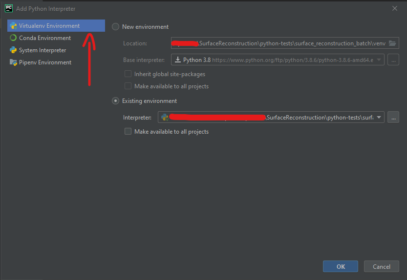

# Poisson Surface Reconstruction: 3D point cloud

Import a point cloud file and perform poisson 3D surface reconstruction algorithm, 
integrated with third-party libraries like [open3d](http://www.open3d.org/docs/release/tutorial/geometry/surface_reconstruction.html?highlight=surface%20reconstruction#Poisson-surface-reconstruction) and [pymeshlab](https://github.com/cnr-isti-vclab/PyMeshLab)

# Installation

## Dependencies

- [python 3](https://www.python.org/downloads/) <= *3.8.x*
  > **Recommended:** Use [pyenv](https://github.com/pyenv/pyenv) to install and manage Python versions
- [numpy](https://numpy.org) >= *1.20*
- [open3d](http://www.open3d.org) >= *0.12*
- [pymeshlab](https://github.com/cnr-isti-vclab/PyMeshLab) >= *0.2*


### Development dependencies

- [setuptools](https://pypi.org/project/setuptools): For installation via `setup.py`
- [setuptools-scm](https://pypi.org/project/setuptools-scm): To generate version numbers from **git tags**
- [wheel](https://pypi.org/project/wheel/): Built packages `.whl` to install packages with PIP 
- [twine](https://pypi.org/project/twine): Publish packages to https://pypi.org
- [tqdm](https://pypi.org/project/tqdm): CLI progressbar when publish a package

# Getting Started

Install a Python <= 3.8.x version using [pyenv](https://github.com/pyenv/pyenv) (recommended)

### Windows

```bash
# With Chocolatey
choco install pyenv-win
```

### Linux

```bash
# With pyenv-installer
curl https://pyenv.run | bash
```

### MacOS

```bash
# With homebrew
brew update
brew install pyenv
```

Check if pyenv was installed sucessfully, and if not got any error in this project

```bash
# Warning: Check if not got any error
pyenv rehash
```

Install same Python version inside of the file **[.python-version](.python-version)** 

```bash
cd [project-folder]

# Loads local version from .python-version file
pyenv local

# PS: The 3.8.2 Python version is latest available in Pyenv for Windows. 
# On Unix systems, is possible install 3.8.8, for example.
pyenv install 3.8.2

# Check the installed version
python --version
```

Create a **Virtual Environment** to store the packages dependencies, and activate it

```bash
python -m venv venv

# Activate

# Windows
.\venv\Scripts\activate.bat

# Unix systems
./venv/Scripts/activate
```

Install all dependencies

```bash
pip install -r .\requirements-dev.txt
```

# Configure Pycharm (Optional)

Define your interpreter in your preferable IDE (**Visual Studio, VSCode**...) from the virtual environment. In this case, we are using [Pycharm](https://www.jetbrains.com/pycharm) as example:

1. Click on `File` => `Settings` => `Python Interpeter`
2. Add your interpreter from your virtual environment (**recommended**)
3. If you prefer, download from the official python.org FTP clicking on `"New enviroment"`, as showed in the picture below



## Install this package

Quick way:

```bash
pip install surface_reconstruction
```

Or clone the repository and run from the project root:

```bash
python setup.py install
```

## Run the unit tests

```bash
# Run all tests of the module "surface_reconstruction_test`
python -m unittest tests/surface_reconstruction_test.py
```

# Usage

Import a `.ply` file with point cloud vertices, and generate the mesh file

```python
from surface_reconstruction import SurfaceReconstruction
import os

# Pass a method/library that contains a Poisson algorithm implementation
surface = SurfaceReconstruction(
  method_type='open3d',
  point_cloud_file=os.path.join('files', 'point_cloud.ply'),
  output_file=os.path.join('files', 'terrain_mesh.ply')
)

# Call the method from the specific library, and export a mesh file
surface.poisson_mesh()
```

You can pass custom filters/parameters for the specific library. This is important because 
poisson algorithm requires some pre-filters before to be applied (e.g **estimate normals** in the point cloud)

```python
# ...
parameters = {
  'estimate_normals': {
    'fast_normal_computation': False,
    'normals': (1, 3)
  }
}

# Unpack the dictionary "parameters" as a **kwargs
surface.poisson_mesh(**{'filters': parameters})
```
> **PS:** See the unittests inside **[tests](./tests)** folder for more usage examples

# Extending: Add new libraries

Is possible create and register custom strategies to allow others libraries (`Python`, `C++` bindings...)

```python
from surface_reconstruction import SurfaceStrategy, SurfaceReconstruction 

# Create a class that inherit from "SurfaceStrategy"
class MyCustomSurface(SurfaceStrategy):
  
      def __init__(self, my_custom_param: dict):
        """
        Custom constructor with custom parameters
        """
        super.__init__()
  
      def load_file(self, file_path: str):
        """
        Custom load point cloud file implementation here
        """
        pass

    def poisson_mesh(self, save_file=True, **params: {}):
      """
      Generate the mesh file with faces/triangles here
      """
      pass

# Register your custom strategy here
SurfaceReconstruction.register_type(MyCustomSurface)


# Pass a method/library that contains a Poisson algorithm implementation
surface = SurfaceReconstruction(
  method_type='mycustom', # Don't pass the "surface" suffix
  my_custom_param={'extra_config': 'some_value'},
)

# Call the method from the specific library, and export a mesh file
surface.poisson_mesh()
```